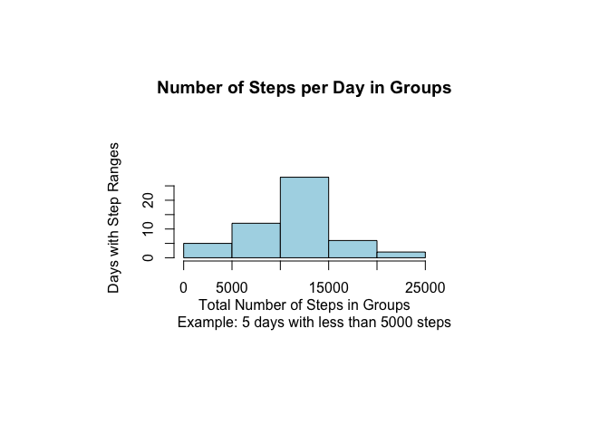
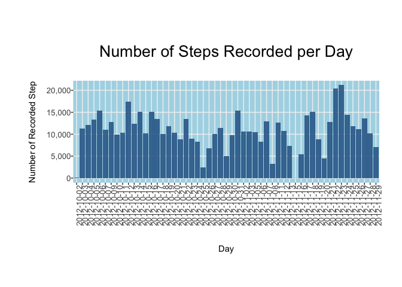
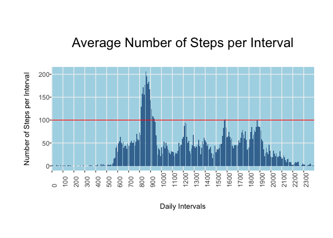
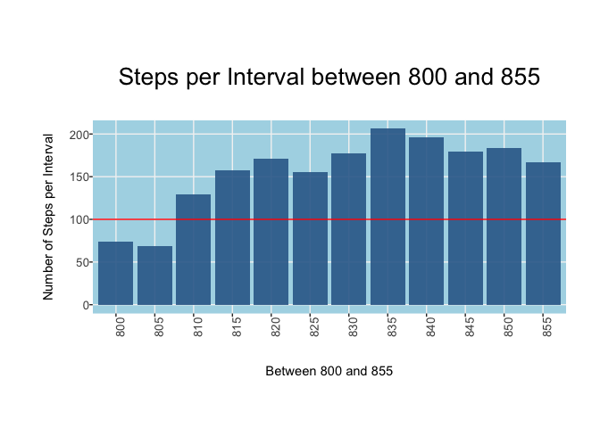
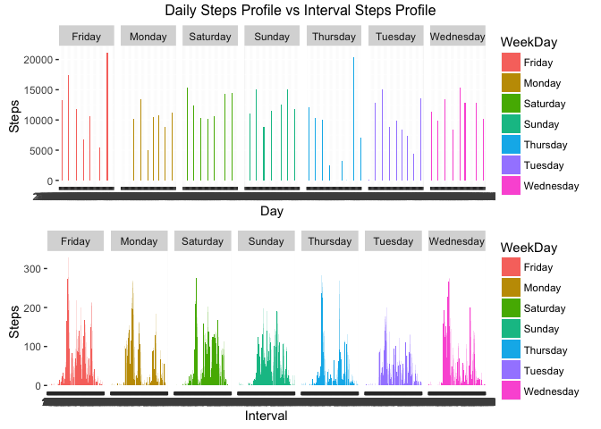

# Reproducible Research: Peer Assessment Bjoern W. Steffens


## Loading and preprocessing the data

We will be using ggplot2 to plot data and read.csv to load the data during this exercise.


```r
#
# Load the libraries we are going to use
# and clean out any left-overs in the $env
rm(list=ls())
dev.off(dev.list())
```

```
## null device 
##           1
```

```r
library(ggplot2)
library(dplyr)
```

```
## 
## Attaching package: 'dplyr'
## 
## The following objects are masked from 'package:stats':
## 
##     filter, lag
## 
## The following objects are masked from 'package:base':
## 
##     intersect, setdiff, setequal, union
```

```r
library(grid)
library(gridExtra)
library(data.table)
```

```
## 
## Attaching package: 'data.table'
## 
## The following objects are masked from 'package:dplyr':
## 
##     between, last
```

```r
#
# Read the csv file and transform the date string to a proper date
# and the interval to a factor
steps <- read.csv("activity.csv")
steps$date <- as.Date(steps$date,"%Y-%m-%d")
steps$interval <- as.factor(steps$interval)
```


## What is mean total number of steps taken per day?

Looking at the available data there are missing values that are ignored for now. The code below shows 5 categories in which the days can be group into.

Note: Plots do not contain any missing values. They have all been filtered out prior to the plot command.


```r
#
# Clean out the NAs
steps <- steps[complete.cases(steps),]

#
# Get the number of steps per day and clean up column names
stepsDay <- as.data.frame(tapply(steps$steps,steps$date,sum))
stepsDay$Day <- row.names(stepsDay)
colnames(stepsDay) <- c("Steps","Day")

#
# Add the mean, median and WeekDay values to the data.frame
stepsDay$AvgSteps <- rep(mean(stepsDay$Steps),nrow(stepsDay))
stepsDay$MedSteps <- rep(median(stepsDay$Steps),nrow(stepsDay))
stepsDay$WeekDay <- weekdays(as.Date(stepsDay$Day))

#
# Plot the historgram of the step groups.
par(mar=c(10,10,10,10))
hist(stepsDay$Steps, 
     xlab = "Total Number of Steps in Groups
     Example: 5 days with less than 5000 steps", 
     ylab = "Days with Step Ranges", 
     main = "Number of Steps per Day in Groups",
     col = "lightblue")
```

 


```r
#
# Plot it on the X axis, dont plot legend and turn the x-labels
g <- ggplot(stepsDay, aes(x=Day, y=Steps, fill = 20))
g + geom_bar(stat = "Identity", alpha = 0.9) +
    theme(axis.text.x = element_text(angle = 90, hjust = 0)) +
    theme(panel.background = element_rect(fill = "lightblue")) +
    theme(strip.background = element_rect(fill = "lightblue")) +
    theme(panel.grid.minor = element_blank()) +
    theme(panel.grid.major = element_line(colour = "grey95")) +
    theme(plot.margin=unit(c(2,1,1.5,1.2),"cm")) +
    scale_y_continuous(labels = scales::comma) +
    theme(legend.position="none") +
    theme(axis.text.x = element_text(size=10,margin = margin(0,0,20,0))) +
    ylab("Number of Recorded Step") + 
    theme(axis.text.y = element_text(size=10,margin = margin(0,0,0,10))) +
    ggtitle("Number of Steps Recorded per Day") +
    theme(plot.title = element_text(size = 20,margin = margin(0,0,30,0)))
```

 


## What is the average daily activity pattern?

If we take the average of the steps in each interval across the entire data set we see that the interval in between ~800 and ~900 in the morning seems a likely candidate for the most active period during the day.


```r
#
# Lets grab the average values for the intervals first
# and fix the column names
stepsAvgInt <- as.data.frame(tapply(steps$steps,steps$interval, mean))
stepsAvgInt$Interval <- row.names(stepsAvgInt)
colnames(stepsAvgInt) <- c("Steps","Interval")

#
# Ensure geom_bar does not try and sort the x Axis
stepsAvgInt$Interval <- factor(stepsAvgInt$Interval, levels = stepsAvgInt$Interval)

g <- ggplot(stepsAvgInt, aes(x=Interval, y=Steps, fill = 20))
g + geom_bar(stat = "Identity", alpha = 0.9) + geom_hline(yintercept=100, col = "red") +
    theme(axis.text.x = element_text(angle = 90, hjust = 0)) +
    theme(panel.background = element_rect(fill = "lightblue")) +
    theme(strip.background = element_rect(fill = "lightblue")) +
    theme(panel.grid.minor = element_blank()) +
    theme(panel.grid.major = element_line(colour = "grey95")) +
    theme(plot.margin=unit(c(2,1,1.5,1.2),"cm")) +
    scale_y_continuous(labels = scales::comma) +
    theme(legend.position="none") +
    xlab("Daily Intervals") +
    #
    # ticks only at the full hour
    scale_x_discrete(breaks=seq(0,2355,100)) +
    theme(axis.text.x = element_text(size=10,margin = margin(0,0,20,0))) +
    ylab("Number of Steps per Interval") + 
    theme(axis.text.y = element_text(size=10,margin = margin(0,0,0,10))) +
    ggtitle("Average Number of Steps per Interval") +
    theme(plot.title = element_text(size = 20,margin = margin(0,0,30,0)))
```

 


Looking closer at the data in between 0800 and 0900 we see that there are values below 100 steps so I should take a deeper look into that later to get a better specification of the interval.


```r
#
# visual inspection gives us the time interval between 0800 and 0900 
# in the morning seems to be the most active ones.
stepsMaxInt <- stepsAvgInt[with(stepsAvgInt, stepsAvgInt$Interval %in% seq(800,855,5)),]

#
# lets plot that
g <- ggplot(stepsMaxInt, aes(x=Interval, y=Steps, fill = 20))
g + geom_bar(stat = "Identity", alpha = 0.9) + geom_hline(yintercept=100, col = "red") +
    theme(axis.text.x = element_text(angle = 90, hjust = 0)) +
    #theme(axis.ticks.x = element_blank()) +
    #theme(axis.ticks.length = 12) +
    theme(panel.background = element_rect(fill = "lightblue")) +
    theme(strip.background = element_rect(fill = "lightblue")) +
    theme(panel.grid.minor = element_blank()) +
    theme(panel.grid.major = element_line(colour = "grey95")) +
    theme(plot.margin=unit(c(2,1,1.5,1.2),"cm")) +
    scale_y_continuous(labels = scales::comma) +
    theme(legend.position="none") +
    xlab("Between 800 and 855") +
    #
    # ticks only at the full hour
    theme(axis.text.x = element_text(size=10,margin = margin(0,0,20,0))) +
    ylab("Number of Steps per Interval") + 
    theme(axis.text.y = element_text(size=10,margin = margin(0,0,0,10))) +
    ggtitle("Steps per Interval between 800 and 855") +
    theme(plot.title = element_text(size = 20,margin = margin(0,0,30,0)))
```

 


We learn that simply taking the daily average across the entire data set will be a bad strategy for imputing mussing data. We also see that depening on what time during the day and also the day of week.

Let's investigate that in more detail and see if we can learn more for implementing an impute strategy


```r
#
# Lets split the stuff out per day of week

#
# Average steps per weekday, day
stepsAvgWday <- arrange(stepsDay %>% group_by(WeekDay,Day) %>% summarise(mean(Steps)),WeekDay,Day)
colnames(stepsAvgWday) <- c("WeekDay","Day","Steps")
#

g <- ggplot(stepsAvgWday, aes(x=Day, y=Steps))
p1 <- g + geom_bar(stat = "Identity", aes(fill=WeekDay)) +
    facet_grid(.~WeekDay) 

#
# Compare this with the number of steps per interval and day
steps$WeekDay <- weekdays(as.Date(steps$date))
stepsAvgDayInt <- arrange(steps %>% group_by(WeekDay,interval) %>% summarise(mean(steps)),WeekDay,interval)
colnames(stepsAvgDayInt) <- c("WeekDay","Interval","Steps")

g <- ggplot(stepsAvgDayInt, aes(x=Interval, y=Steps))
p2 <- g + geom_bar(stat = "Identity", aes(fill=WeekDay)) +
    facet_grid(.~WeekDay) 

grid.arrange(p1,p2, nrow = 2, ncol = 1, top = "Daily Steps Profile vs Interval Steps Profile")
```

 


New information from these plots are that Fridays and Thursdays have higher average number of steps. We also see that during the night we have considerably less steps and may need to consider assigning a very low value between 12:00am and 06:00am for missing values.


## Imputing missing values


## Are there differences in activity patterns between weekdays and weekends?
